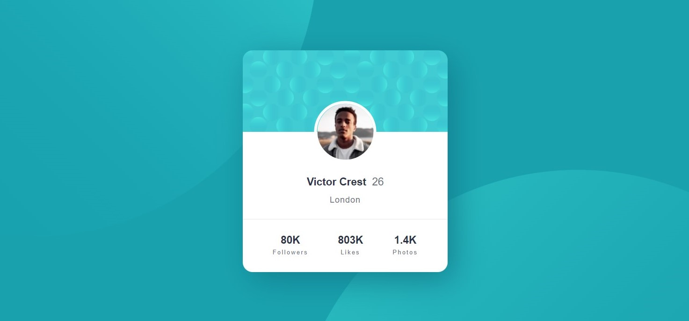

# Frontend Mentor - Profile card component solution

This is a solution to the [Profile card component challenge on Frontend Mentor](https://www.frontendmentor.io/challenges/profile-card-component-cfArpWshJ). Frontend Mentor challenges help you improve your coding skills by building realistic projects. 

## Table of contents
- [Overview](#overview)
  - [The challenge](#the-challenge)
  - [Screenshots](#screenshots)
  - [Live site](#Live-site)
- [My process](#my-process)
  - [Built with](#built-with)
  - [What I learned](#what-i-learned)
  - [Continued development](#continued-development)
- [Author](#author)
- [Acknowledgments](#acknowledgments)

## Overview

### The challenge

- Build out the project to the designs provided

### Screenshots

### Live site

- Live site URL: [Add live site URL here](https://your-live-site-url.com)

## My process

### Built with

- Semantic HTML5 markup
- CSS custom properties
- Flexbox
- Responsive design

### What I learned

By doing this project, I learned to work better with Flexbox and improved my knowledge in using and combining background properties.

### Continued development

In future projects, I would like to focus on responsive design and better code writing.

## Author

- Frontend Mentor - [@MartaStepaniuk](https://www.frontendmentor.io/profile/MartaStepaniuk)
- GitHub - [@MartaStepaniuk](https://github.com/MartaStepaniuk)
